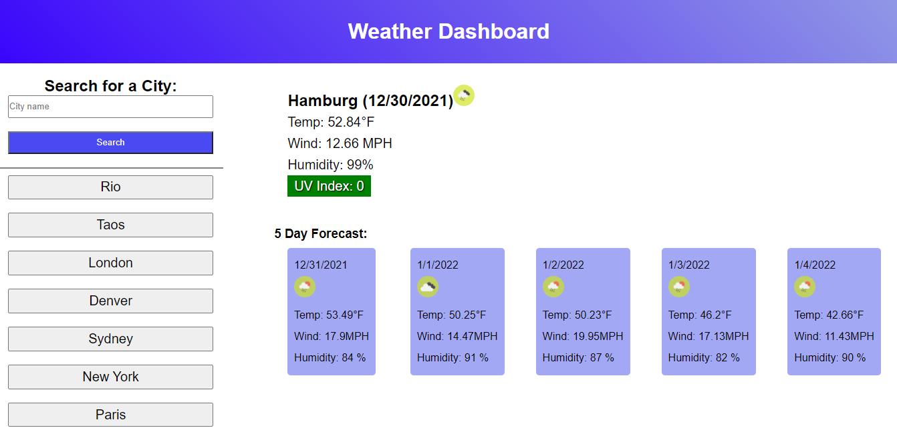

# Weather Dashboard

## Description
This is a single page application built with HTML, CSS, and JavaScript. It allows a user to enter a city and receives the current weather data and a forecast for the next five days. The application uses moment.js to keep track of the date and the fetch API to make calls to the Open Weather API for current and future weather data. Searches are stored in local storage and displayed as buttons to allow users to quickly pull up relevant weather data.

## Usage

Screenshot

The user can enter any city listed in the Open Weather API and receive current weather data and forecast data for the next five days. Any cities that have been previously searched will show up in the left/top panel to easily display their current data again. When a city is searched the name of the city and current date are displayed, with an icon for the current conditions. Temperature, wind speed, humidity, and UV index are also displayed for the current moment.

Beneath the current data there are 5 cards, each displaying forecast weather data for the next 5 days, with each date at the top of the card. If a city is not available the user is directed to the Open Weather API website.

### Link to deployed application
https://soundproofboot.github.io/weather-dashboard/

### Credits
All code for this project is original but the concept was inspired by a project for U of M bootcamp.

### Third-party APIs used
Moment.js
https://momentjs.com/

OpenWeather API (Current Weather)
https://openweathermap.org/current

OpenWeather API (One Call)
https://openweathermap.org/api/one-call-api